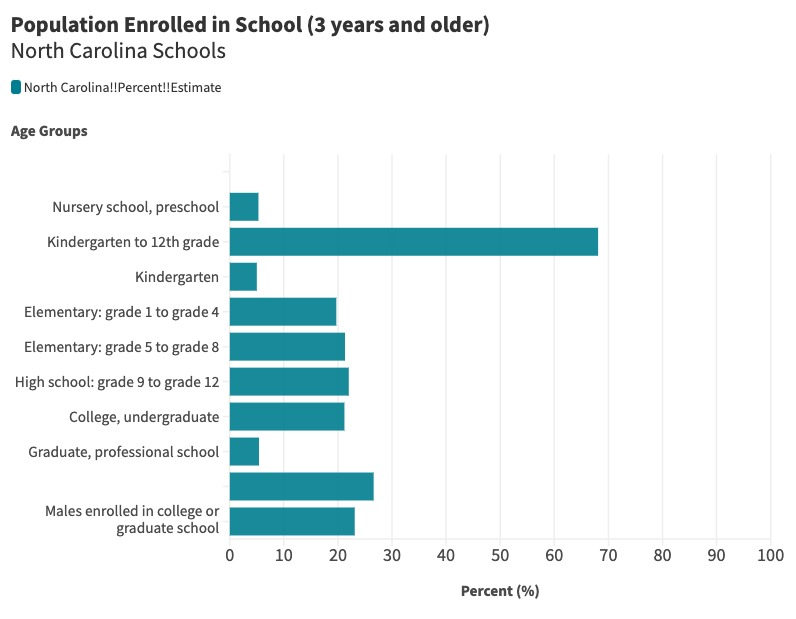
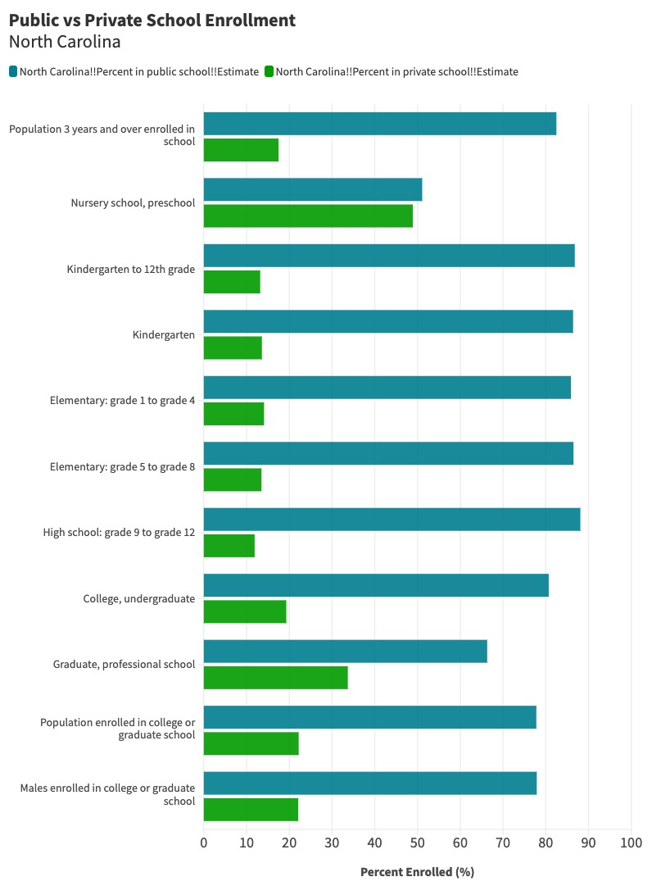

# North Carolina School Enrollment 

This repository compares the enrollment rates or age groups, from preschool to university, of North Carolina Students in public and private schools. Both the enrollment of public and private schools are also compared to the total enrollment rate across all students in the state. 

## Data Sourcing 

The data used was sourced from the United States Census Bureau 
This data is a combination of estimations and information collected in 2022 by the American Community Survey

The data can be found using this link 
[https://data.census.gov/](https://data.census.gov/table/ACSST1Y2022.S1401?q=schools%20in%20north%20carolina)

For users getting involved with this dataset, the subsets were created using basic Python coding language inside of a Colab notebook. 

Further information and details regarding the coding proccess for reproduction can be found in the CensusData.ipynb file

## About the Data 
### Findings 

The purpose of this repository was to investigate the enrollment differences between the makeup of private and public schools in North Carolina. 

### The Starting Point: Large Data Set

The extensive data set from the Census Bureau, *NCed*, contained estimates and percentages across total, private, and public school enrollment.

### Analyzing The Large Data: Subsets

This larger dataset created a new dataset *Enrolled*, only showing the percentage of the eligible population enrolled in every school age group.

*Enrolled*, as a controlled variable, was collected and placed into a visualization expressed in percent of the total eligible population 

Another subset was created, *PrivatePublic*, separating the enrollment rates of school-age groups in public and private schools.

Then, using the variables *Percent in Public School Estimate* and *Percent in Private School Estimate*, the two enrollment rates were separated and compared to each other 

## Interpretation

The comparison of the private and public schools next to each other allows users to conclude the funding of schools, the advantages and disadvantages of the institutions, and perceptions surrounding the two. 

Additionally, comparing the institution types next to average enrollment rates creates a clear distinction between which option, public or private, is more atypical with their enrollment. 

Any anomalies, including the near 50/50 divide in public and private nursery schools, can also be further explored to explain why outliers may exist. 

## About the Repository

English 105 Final Project- Gotzler

This repository is made and maintained by Kara Dugan to clearly outline the differences between public and private schools for future use, discussing the funding allocated to these institutions and the perceptions surrounding them. 

For precise, unedited data, users should refer to the source for help with interpretation

The data can be found using this link 
[https://data.census.gov/](https://data.census.gov/table/ACSST1Y2022.S1401?q=schools%20in%20north%20carolina)
